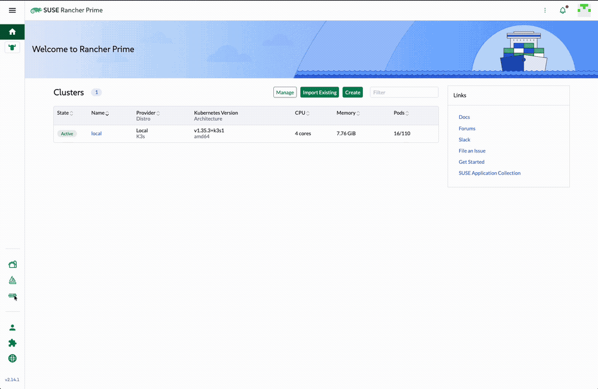
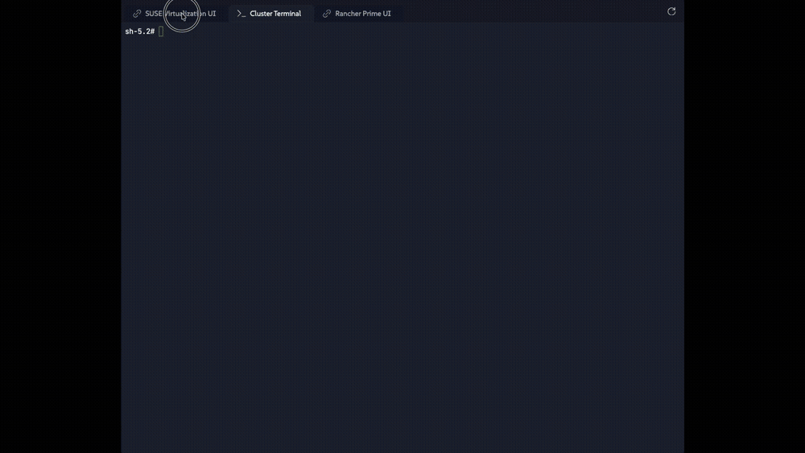

# Exercise 1: The Arrival

**Time:** 30 min  
**Next:** [Exercise 2: The Subterranean Divide](02-subterranean-divide.md)

---


Vertex Trust Bank is drowning in legacy hypervisor costs. Sarah, the CTO, hands you a fresh **SUSE Virtualization** (Harvester) cluster and a Rancher Prime instance that do not know about each other yet. Your first job: connect them, tour the UIs, and confirm you can drive the platform from a terminal.

After `rodeo up`, Harvester and Rancher are up; import is intentionally left for you. Passwords are in `~/.rodeo/secrets.yaml` on the KVM host (`harvester_admin_password`, `rancher_admin_password`).

| Field | Value |
|---|---|
| Username | `admin` |
| Harvester UI | `https://<host-ip>:8443` |
| Rancher UI | `https://<host-ip>:30002` |
| Passwords | from `~/.rodeo/secrets.yaml` |

> **Note:** Both UIs use self-signed certificates. Accept the browser security warning when it appears.

## 1.1 Verify both backends

From a shell on the KVM host:

```bash
curl -sk https://192.168.122.10/v1 | jq -r '.apiVersion'
curl -sk https://192.168.122.9:30002/v3 | jq -r '.type'
rodeo status
```

Expect a Harvester API version and `collection` from Rancher. `rodeo status` should show three Harvester nodes and the rancher VM running.

## 1.2 Import Harvester into Rancher

1. Open Rancher at `https://<host-ip>:30002` and log in as `admin`.
2. Left sidebar → **Virtualization Management** → **Import Existing**.
3. Set **Cluster Name** to `harvester` (exact name, later exercises assume it).
4. Click **Create**, then copy the registration URL shown (`https://192.168.122.9:30002/v3/import/...yaml`).

In the Harvester UI (`https://<host-ip>:8443`):

1. Left sidebar → **Settings** (gear).
2. Find **cluster-registration-url** → edit → paste the URL → check **Insecure Skip TLS Verify** (Rancher's cert is self-signed) → **Save**.



Wait 1-3 minutes. In Rancher → Virtualization Management the cluster moves `Pending` → `Waiting` → **Active**.

> **Important:** the cluster name must be exactly `harvester`. Later exercises assume it.

## 1.3 Tour the SUSE Virtualization dashboard

Open the Harvester UI (directly or via Rancher → Virtualization Management → **harvester**).



On the **Dashboard**, confirm:

- **Hosts** - three nodes
- **Virtual Machines** - `webserver-prod` and `daily-batch-processor` already running. Deploy automation pre-creates them as its last step; you'll use both in Exercise 4
- **Images**, **Volumes**, capacity and metrics panels
- Bottom-left **Support** → **Download KubeConfig** (save it, you will need it)
- **Generate Support Bundle** - know where it is for real incidents

Do not change anything yet. This exercise is orientation plus the import.

## 1.4 Meet Rancher Prime

Back in Rancher:

- **Cluster Management** still lists `local` (Rancher's own K3s).
- **Virtualization Management** now lists `harvester` as **Active**.

Rancher is the fleet commander: identity, multi-cluster, and later the place you provision guest Kubernetes. Harvester remains the place you run VMs.

## 1.5 Terminal access

From the KVM host:

```bash
rodeo ssh harvester1
kubectl get nodes
kubectl get pods -n harvester-system | grep -v Completed
exit
```


All three nodes should be `Ready`. Core Harvester pods should be running.

Optional: point your laptop kubectl at the kubeconfig you downloaded from **Support**, or build a Rancher-proxied kubeconfig (API key under the user avatar → Account & API Keys). Either path works for the rest of the lab.

**Check your work:** `sudo bash -c 'cd /root/rodeo-lab && ./checks/check-exercise-1.sh'`.

---

**Next:** [Exercise 2: The Subterranean Divide](02-subterranean-divide.md)
