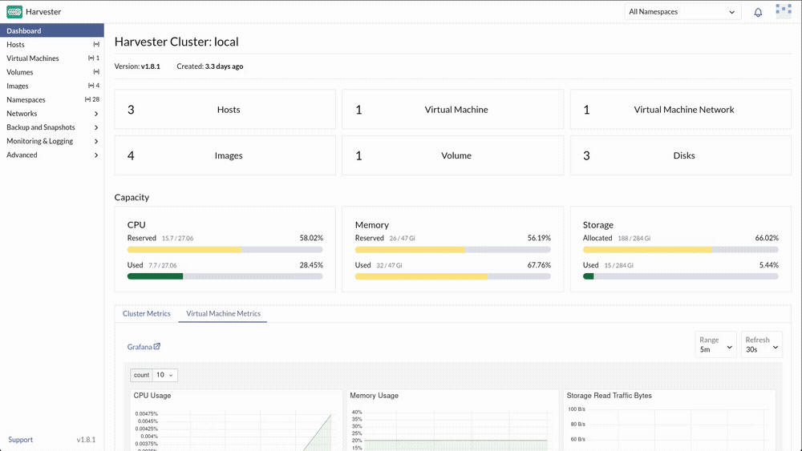
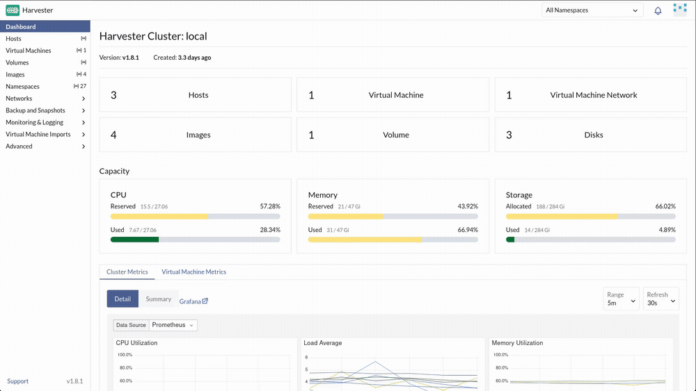
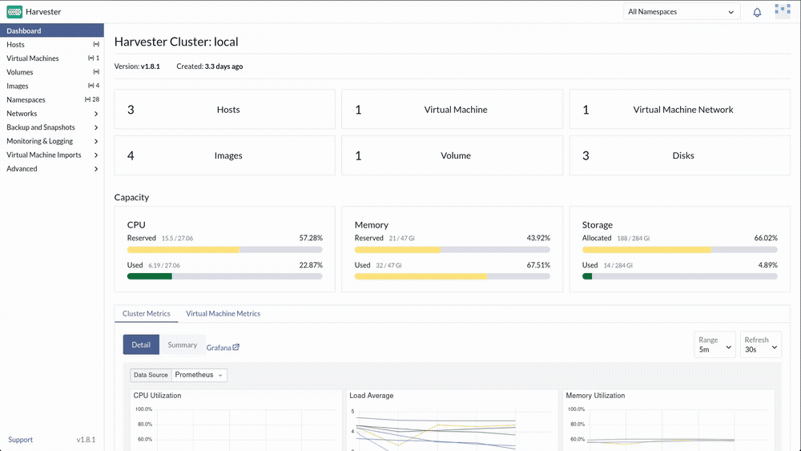
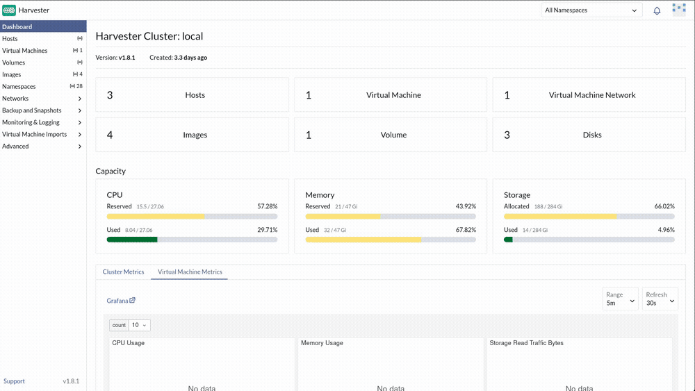

# Exercise 2: The Subterranean Divide

**Time:** 30 min  
**Previous:** [Exercise 1: The Arrival](01-the-arrival.md)  
**Next:** [Exercise 3: The Flash Crash](03-flash-crash.md)

---


Sarah takes you into the subterranean datacenter. One side of the room is containerized APIs; the other still runs heavy ledgers. Both will share the same SUSE Virtualization fabric. First you map the nodes, carve workspaces, set storage policy, and build the production service network the later exercises need.

> **Tip:** The customer Rodeo image pre-creates `prod`, `prod/service`, and an SSH key. This lab's deploy automation now pre-creates `prod` and `prod/service` too, plus node labels. So 2.2 and 2.5 below are a confirm, not a create. You still register your own SSH key in 2.6, since the automation only embeds it directly into pre-created VMs' cloud-init, not into a reusable Harvester `SSHKey` object.

## 2.1 Inspect node topology and Longhorn on disk

In the Harvester UI → **Hosts**:

1. Open one host and review reserved vs used CPU/memory, IP, and disks.
2. Each disk you see feeds the Longhorn pool that will hold VM volumes.



From the KVM host terminal:

```bash
rodeo ssh harvester1
ls /var/lib/harvester/defaultdisk
ls /var/lib/harvester/defaultdisk/replicas/
exit
```

Replicas on disk are how Longhorn keeps VM data alive across node loss.

## 2.2 Confirm `prod`, create `dev`

**Namespaces**: `prod` already exists. Deploy automation created it, along with two VMs already running inside it (you'll meet them in Exercise 4). Open it and confirm it's there.

**Namespaces** → **Create**:

| Name |
|------|
| `dev` |



`prod` holds bank production VMs; `dev` is for cheaper sandboxes.

## 2.3 Understand the default storage class

**Advanced → Storage Classes** → open `harvester-longhorn`.



Note **Number Of Replicas = 3**. Production ledgers want that. Disposable quant sandboxes do not. Replica count is a policy, not a law of physics.

## 2.4 Build a cost-tier StorageClass

**Advanced → Storage Classes → Create**:

| Field | Value |
|---|---|
| Name | `harvester-longhorn-1rep` |
| Provisioner | `driver.longhorn.io` |
| Number of replicas | `1` |
| Allow volume expansion | yes |
| Reclaim policy | Delete |

Parameters (if the form exposes them as YAML/custom):

```yaml
numberOfReplicas: "1"
staleReplicaTimeout: "30"
migratable: "true"
```



> **Optional:** everything above is also visible through the Kubernetes API. Open the Harvester cluster terminal and run `kubectl get storageclass` to see both tiers as API objects.
>
> 

## 2.5 Confirm the production VM network

VMs need a network on the management fabric so you can SSH them from the host. Deploy automation already created it:

**Networks → Virtual Machine Networks**: confirm `prod/service` shows **Active** (Type `UntaggedNetwork`, bridged on the management fabric).

If it's ever missing (a previous run failed before this step), create it yourself:

| Field | Value |
|---|---|
| Namespace | `prod` |
| Name | `service` |
| Type | `UntaggedNetwork` |
| Cluster Network | `mgmt` |

## 2.6 Register an SSH key

Generate a key on the KVM host if you do not already have one:

```bash
test -f ~/.ssh/id_ed25519.pub || ssh-keygen -t ed25519 -N '' -f ~/.ssh/id_ed25519
cat ~/.ssh/id_ed25519.pub
```

In Harvester: **Advanced → SSH Keys → Create**:

| Field | Value |
|---|---|
| Namespace | `prod` |
| Name | `default` |
| SSH Public Key | paste the `.pub` contents |

Later exercises select **SSH Key: `prod/default`**.

## 2.7 Upload a cloud image

Deploy automation already downloaded and cached an openSUSE Leap Micro cloud image on the KVM host, serving it at `http://192.168.122.1:8889/` so this step needs no internet access from inside the cluster. Leap Micro is the right pick here specifically because it ships cloud-init, which the next step depends on.

**Images → Create**:

| Field | Value |
|---|---|
| Namespace | `official-images` (create the namespace if prompted) |
| Name | `sles16` |
| URL | `http://192.168.122.1:8889/openSUSE-Leap-Micro.x86_64-Default-qcow.qcow2` |

Wait until the image is **Active** (download is server-side via Longhorn, and fast since the image is already local).

> **No local cache?** (a manual bare-metal deploy without this workshop's `custom_scripts`) Use any SLES 16 or openSUSE Leap cloud qcow2 URL your lab can reach instead. Whatever you pick, confirm it ships **cloud-init**, not only combustion. Exercise 2.8's user-data and Exercise 3's cloud-init steps silently do nothing on an image that lacks it, and the VM still boots fine, which makes this easy to miss.

If your environment already mirrors a SLES 16 Minimal VM cloud image with cloud-init, prefer that and note the exact image name. Exercise 3 will reference whatever you upload here as the golden OS image.

## 2.8 Optional: cloud-init user-data template

**Advanced → Cloud Config Templates → Create** (User Data):

| Field | Value |
|---|---|
| Namespace | `prod` |
| Name | `prod` |

Minimal user-data (installs and starts `qemu-guest-agent`; SSH access itself uses the image's own default account, `sles` for the cached Leap Micro image from 2.7):

```yaml
#cloud-config
package_update: true
packages:
  - qemu-guest-agent
runcmd:
  - systemctl enable --now qemu-guest-agent
```

Exercise 3 can select **User Data Template: `prod/prod`**.

**Check your work:** `./checks/check-exercise-2.sh` from the KVM/EC2 host.

---

**Next:** [Exercise 3: The Flash Crash](03-flash-crash.md)
