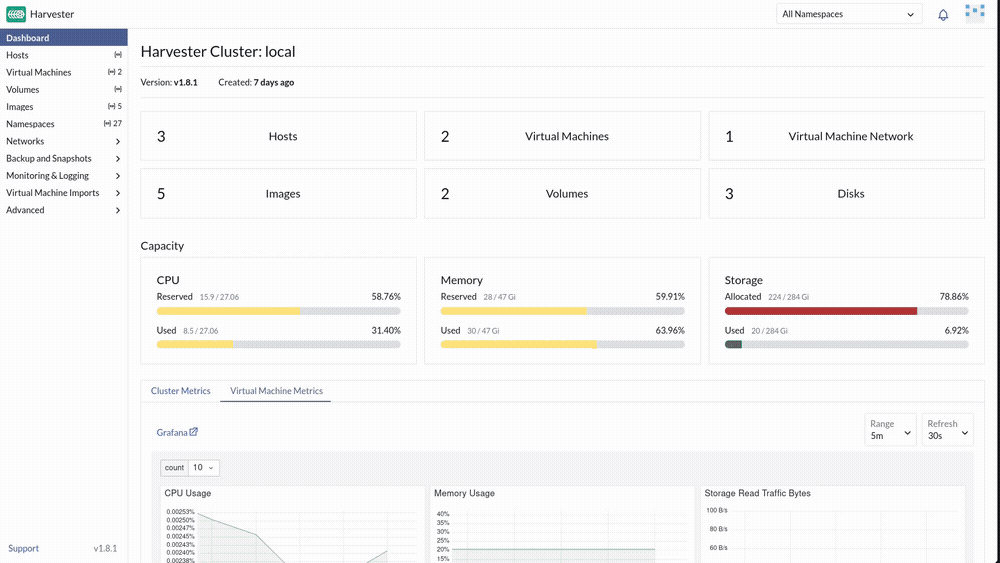
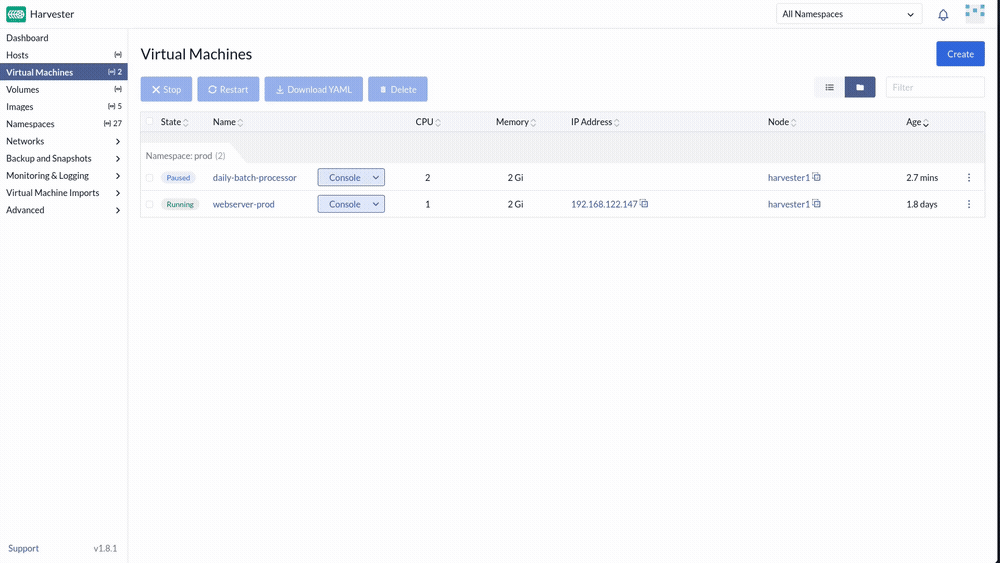
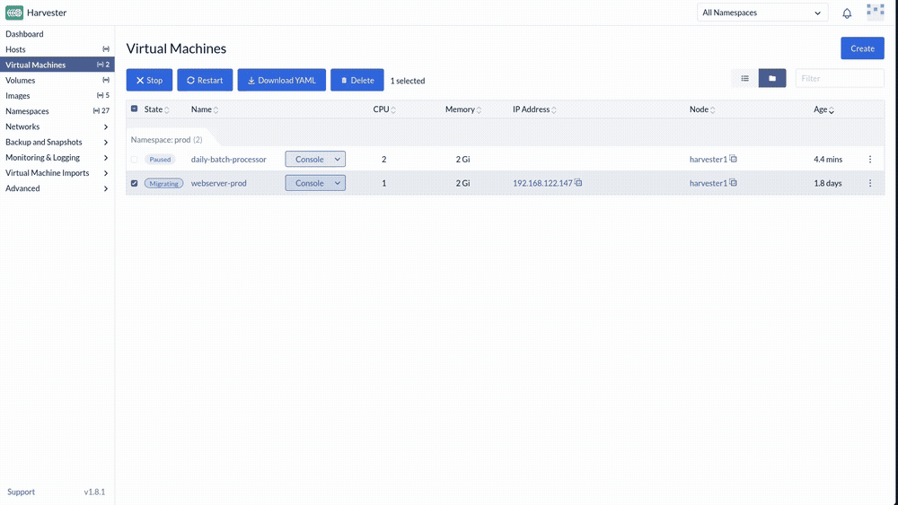
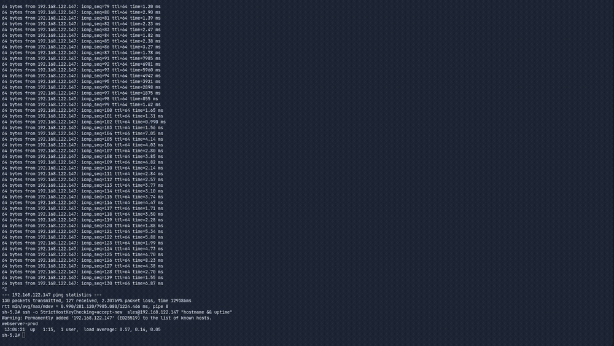
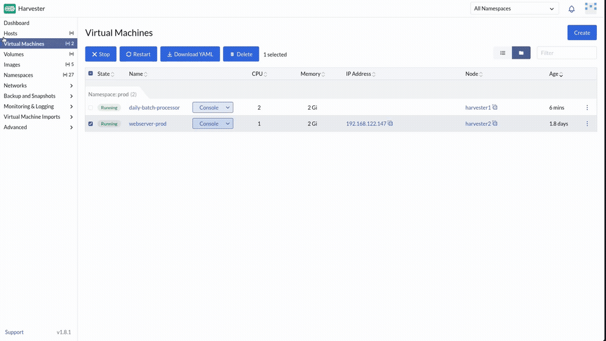
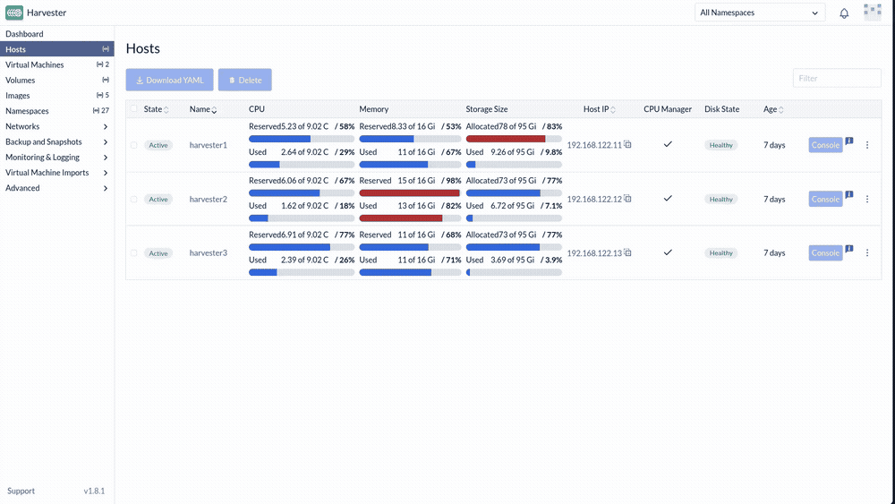

# Exercise 4: The Rising Tide

**Time:** 25 min  
**Previous:** [Exercise 3: The Flash Crash](03-flash-crash.md)  
**Next:** [Exercise 5: The Invisible Intruder](05-invisible-intruder.md)

---


A coolant leak is flooding the rack under the payment gateway. You need a **zero-downtime live migration** while transactions keep flowing, then put the damaged node into maintenance so everything else evacuates automatically.

On the Instruqt Rodeo, `webserver-prod` and `daily-batch-processor` are pre-baked into the image. This lab's deploy automation builds the same pair from scratch as its last phase, so they're already there waiting for you. Same as the Instruqt track, not something you build by hand.

## 4.1 Confirm the payment gateway and batch VM

**Virtual Machines** (namespace `prod`): confirm both are **Running**, on network `prod/service`, DHCP-assigned:

| Name | CPU | Memory | Disk | Purpose |
|---|---|---|---|---|
| `webserver-prod` | 1 | 1 GiB | ~25 GiB (image size, not a typo) | Payment gateway (will migrate) |
| `daily-batch-processor` | 1 | 1 GiB | ~25 GiB | Non-critical (will pause) |

Note the **Node** column for both. `daily-batch-processor` started on the same node as `webserver-prod` (deploy automation pins it there on first boot, then releases the pin), so the two are already sharing hardware, exactly like a real "everything running production on one rack" scenario. Note the IP of `webserver-prod` from the UI.

If either VM is missing (a previous deploy attempt failed before this step), re-run just that phase:

```bash
# from a host with harvester kubeconfig
rodeo deploy --from custom_scripts
```

You may delete `algo-trader-01` first if the host is tight on RAM:

```bash
# optional, from a host with harvester kubeconfig
kubectl delete vm -n prod algo-trader-01 --wait=false
```

## 4.2 Pause non-critical work

**Virtual Machines** → `daily-batch-processor` → ⋮ → **Pause**. Wait until state is **Paused**.



## 4.3 Establish a heartbeat

On the KVM host (replace with the gateway IP from the UI):

```bash
ping WEBSERVER_IP
```



Leave ping running. Do not stop it.

## 4.4 Live-migrate the gateway

1. Note which **Node** `webserver-prod` is on.
2. ⋮ → **Migrate** → pick a **different** healthy node → **Apply**.


3. Watch the UI; keep an eye on the ping window.



When migration finishes, stop ping (`Ctrl+C`). At most you might see one slower reply. The guest OS did not reboot.

```bash
ssh opensuse@WEBSERVER_IP "hostname && uptime"
```

Uptime should **not** have reset. The **Node** column should show the new host.

## 4.5 Resume batch work

`daily-batch-processor` → ⋮ → **Unpause**.



## 4.6 Evacuate the damaged rack

**Hosts** → the node `webserver-prod` **was** on before migration → ⋮ → **Enable Maintenance Mode**.

Watch **Virtual Machines**: remaining guests on that node live-migrate away automatically. When the host shows **Maintenance** and is empty, the flooded rack is safe for hardware work.



Disable maintenance when you are done exploring so the cluster returns to full capacity (⋮ → **Disable Maintenance Mode**).

> **Optional:** every migration is itself a Kubernetes object, so it's auditable. Open the cluster terminal and inspect the migration history for `webserver-prod`.
>
> 

---

**Next:** [Exercise 5: The Invisible Intruder](05-invisible-intruder.md)
