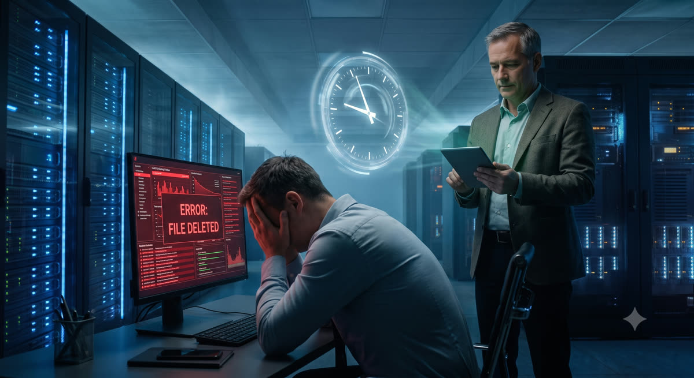
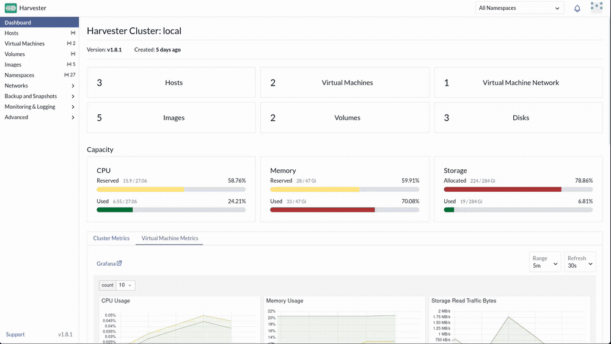
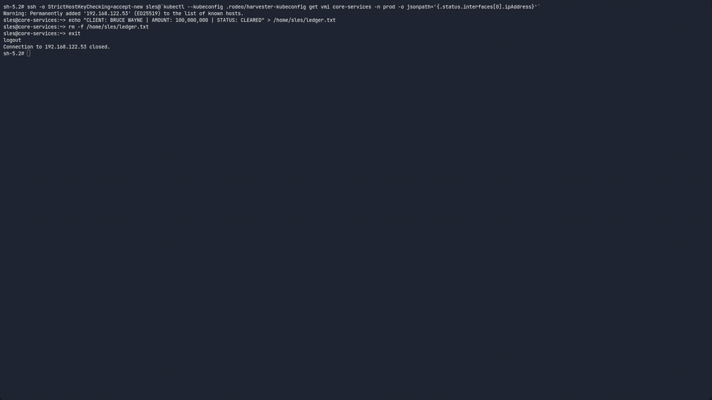
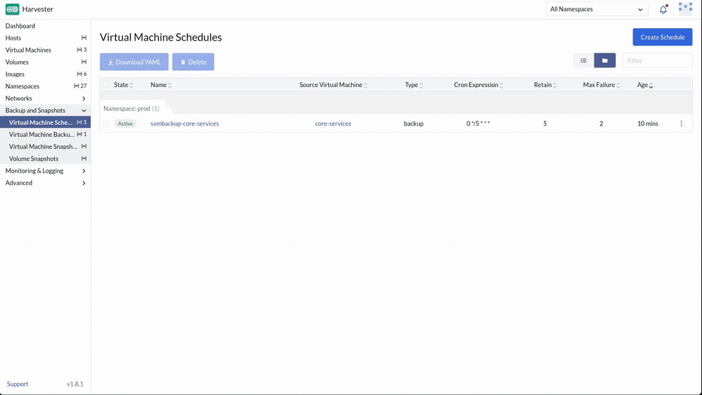
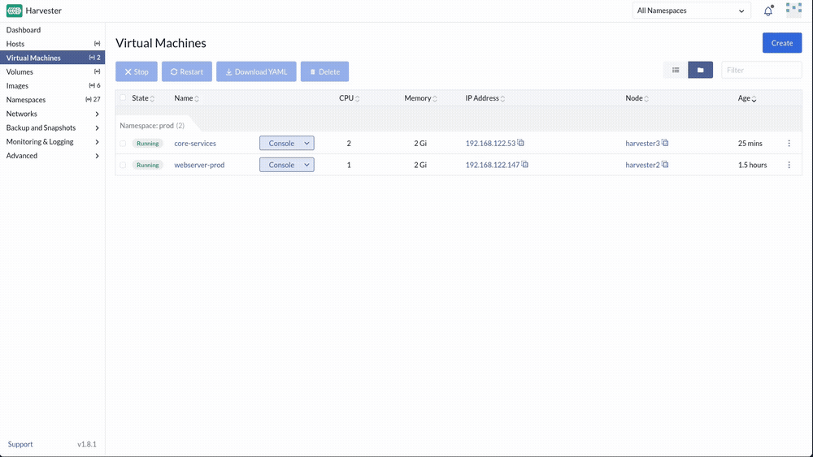
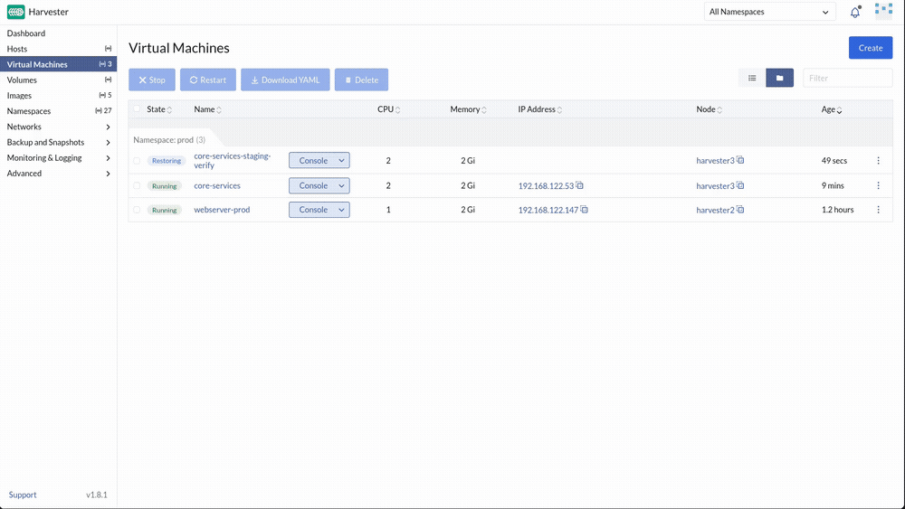
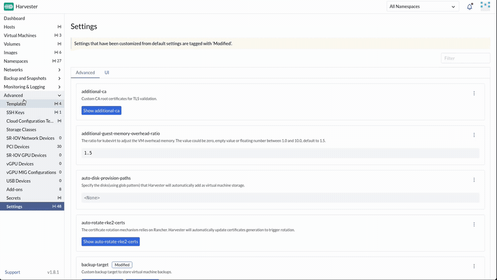

# Exercise 6: The Unthinkable Error

**Time:** 30 min  
**Previous:** [Exercise 5: The Invisible Intruder](05-invisible-intruder.md)  
**Next:** [Exercise 7: The Stampede](07-stampede.md)

---



A junior admin deleted the wrong file on the transaction ledger. You will snapshot, clone to staging, verify, restore production, then point the cluster at an off-cluster NFS backup target and schedule backups.

## 6.1 Prepare a ledger VM

If you do not already have a suitable VM, create `transaction-ledger` in `prod` on `prod/service` (1 CPU / 1 GiB / 5 GiB, same image and SSH key as before). Note its IP from the UI.

SSH in and create the record:

```bash
ssh opensuse@TRANSACTION_LEDGER_IP
echo "CLIENT: BRUCE WAYNE | AMOUNT: 100,000,000 | STATUS: CLEARED" > /home/opensuse/ledger.txt
cat /home/opensuse/ledger.txt
```

Leave the SSH session open or reconnect as needed.

## 6.2 Take a snapshot, then break production

In the UI → `transaction-ledger` → **Snapshots** → **Take Snapshot** → name `pre-disaster-backup`. Wait until **Active**.

On the VM:

```bash
rm /home/opensuse/ledger.txt
cat /home/opensuse/ledger.txt   # should fail
exit
```



## 6.3 Clone to staging from the snapshot

On the snapshot row → ⋮ → **Restore to New Virtual Machine**:

| Field | Value |
|---|---|
| Name | `ledger-staging-verify` |



Wait for the clone to boot and get an IP. SSH in and confirm:

```bash
ssh opensuse@STAGING_IP
cat /home/opensuse/ledger.txt
exit
```



## 6.4 Restore production

1. **Power off** `transaction-ledger`.
2. Snapshot `pre-disaster-backup` → ⋮ → **Restore** → confirm.
3. Power the VM back on.
4. SSH and `cat /home/opensuse/ledger.txt`. The record is back.



## 6.5 Connect an NFS backup target

Snapshots live on the same cluster. Real DR needs an off-cluster target.

Deploy automation already exported `/srv/backups` from the KVM host over NFS. Confirm it from the host if you want to see it (optional):

```bash
showmount -e 192.168.122.1   # expect /srv/backups 192.168.122.0/24
```

In Harvester: **Advanced → Settings → backup-target** → Edit:

| Field | Value |
|---|---|
| Type | NFS |
| Endpoint | `192.168.122.1:/srv/backups/` |

**Save**.



> **Tip:** If `showmount` shows nothing, `custom_scripts`' NFS step failed non-fatally. Most likely an unsupported host OS package manager, see the [pre-lab checklist](../instructor/pre-lab-checklist.md#common-failure-points). Fall back to setting it up by hand: `sudo mkdir -p /srv/backups && sudo chmod 777 /srv/backups`, then install and configure an NFS server exporting that path to `192.168.122.0/24` (package name differs by distro: `nfs-kernel-server` on Ubuntu, `nfs-server`/`nfs-utils` on SLES/Fedora). Either way, the skill is knowing where backup-target lives. S3 endpoints work the same way in production.

## 6.6 Schedule backups

**Virtual Machines** → select `transaction-ledger` (or use **Backup & Snapshots** schedules in your Harvester version):

- Create a recurring backup/snapshot schedule (hourly or daily is fine for the lab).
- Confirm the schedule object appears and the next run is listed.



Exact UI labels vary slightly by Harvester minor version. The goal is a **policy**, not a one-off click.

---

**Next:** [Exercise 7: The Stampede](07-stampede.md)
