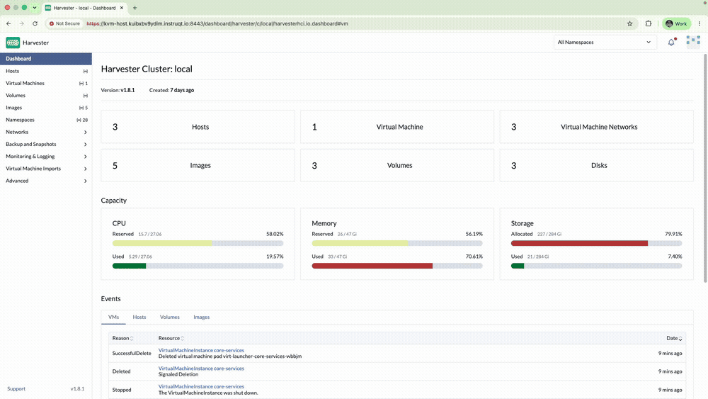
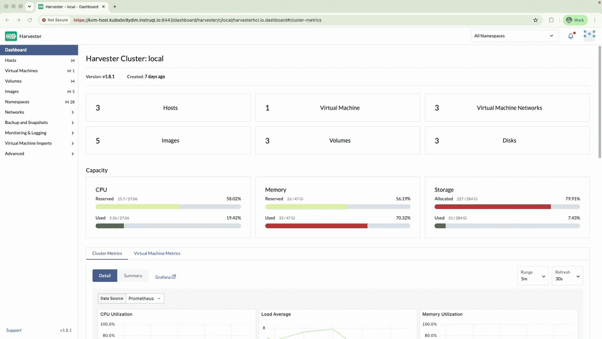
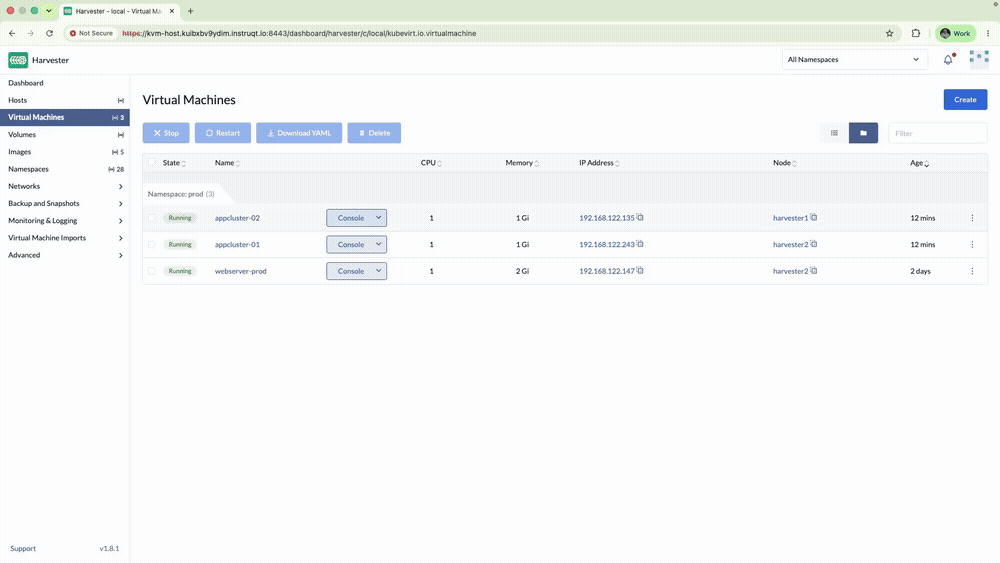

# Exercise 7: The Stampede

**Time:** 25 min  
**Previous:** [Exercise 6: The Unthinkable Error](06-unthinkable-error.md)  
**Next:** [Exercise 8: A New Horizon](08-new-horizon.md) &nbsp;·&nbsp; optional bonus: [The Final Showdown](bonus-final-showdown.md)

---

Markets are in freefall. The Head of Quant needs the calculation fleet scaled from one engine to many, identical machines, on demand. Forge a golden template and stamp them out.

## 7.1 Forge the golden template

**Advanced → Templates → Create**:

| Field | Value |
|---|---|
| Namespace | `harvester-public` |
| Template Name | `prod-basic` |
| CPU | `1` |
| Memory | `1 GiB` |
| SSH Key | `prod/default` |
| Volume image | your Exercise 2 cloud image |
| Network | `prod/service` |
| Label | `stage=prod` |
| User Data Template | `prod/prod` (if present) |

**Create**.

## 7.2 Stamp the initial fleet

From the template → **Create Virtual Machine** (or Virtual Machines → Create from template):

| Name | Namespace |
|---|---|
| `calc-engine-01` | `prod` |
| `calc-engine-02` | `prod` |
| `calc-engine-03` | `prod` |

Wait until all three are **Running**.

## 7.3 Scale under pressure

Create two more from the same template:

| Name |
|---|
| `calc-engine-04` |
| `calc-engine-05` |

Confirm five identical engines in `prod`.

## 7.4 Stand the fleet down

When the spike passes, delete `calc-engine-04` and `calc-engine-05` (and optionally the rest) so capacity returns to the bank. The **template** remains. The next spike is a few clicks, not a ticket queue.

**Check your work:** `./checks/check-exercise-7.sh` from the KVM/EC2 host. This exercise has no automated grading by design (nothing later reads back state created here). The script just points you at what to verify in the UI.

---

**Next:** [Exercise 8: A New Horizon](08-new-horizon.md) &nbsp;·&nbsp; optional bonus: [The Final Showdown](bonus-final-showdown.md)
