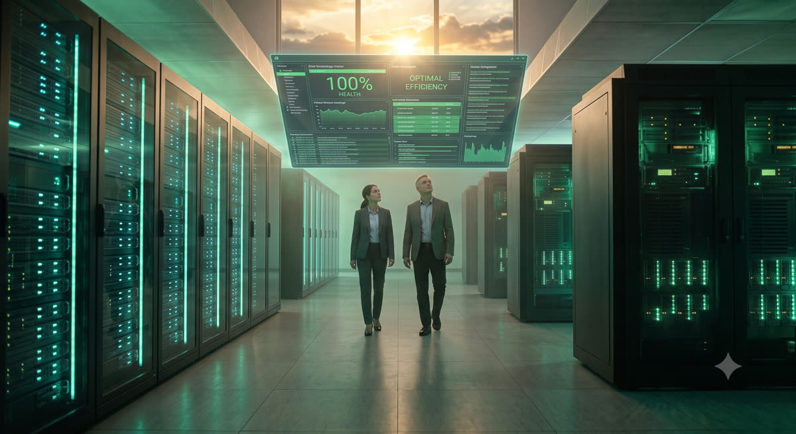

# Exercise 8: A New Horizon

**Time:** 10 min  
**Previous:** [Exercise 7: The Stampede](07-stampede.md)

---



The datacenter is quiet. Vertex Trust Bank runs on SUSE Virtualization end to end: containers and ledgers on one fabric, storage distributed, networks software-defined, licensing no longer a ransom note.

## 8.1 What you mastered

| Exercise | Skill |
|---|---|
| 1 The Arrival | Import Harvester into Rancher; navigate both UIs; kubectl on the cluster |
| 2 Subterranean Divide | Namespaces, Longhorn replica policy, VM network, SSH keys, images |
| 3 Flash Crash | Full VM create: volumes, network, cloud-init, fixed IP |
| 4 Rising Tide | Live migration; maintenance-mode evacuation |
| 5 Invisible Intruder | Cluster networks, untagged isolation, Kube-OVN overlay VPC |
| 6 Unthinkable Error | Snapshots, clone-restore, backup-target, schedules |
| 7 Stampede | VM templates and fleet scale-out |

> Went through the [bonus Final Showdown chapter](bonus-final-showdown.md) too? Add: Migration UI / lift-and-shift mindset, guest agent, day-one ops on migrated VMs.

## 8.2 Where to go next

- [SUSE Virtualization docs](https://documentation.suse.com/cloudnative/virtualization/)
- [Rancher Prime / Virtualization Management](https://documentation.suse.com/cloudnative/rancher-manager/)
- Rebuild this lab anytime: `rodeo clean --yes && rodeo up` from this repo
- Customer-facing interactive twin: [suse-virt-rodeo](https://github.com/avaleror/suse-virt-rodeo)
- Automation that built your host lab: [rodeo-cli](https://github.com/avaleror/rodeo-cli)

## 8.3 Tear down (when finished)

```bash
rodeo clean --yes                     # remove lab VMs
rodeo clean --all --yes --secrets     # full host reset
```

Sarah was right to bet on the new stack. You proved it under fire.
