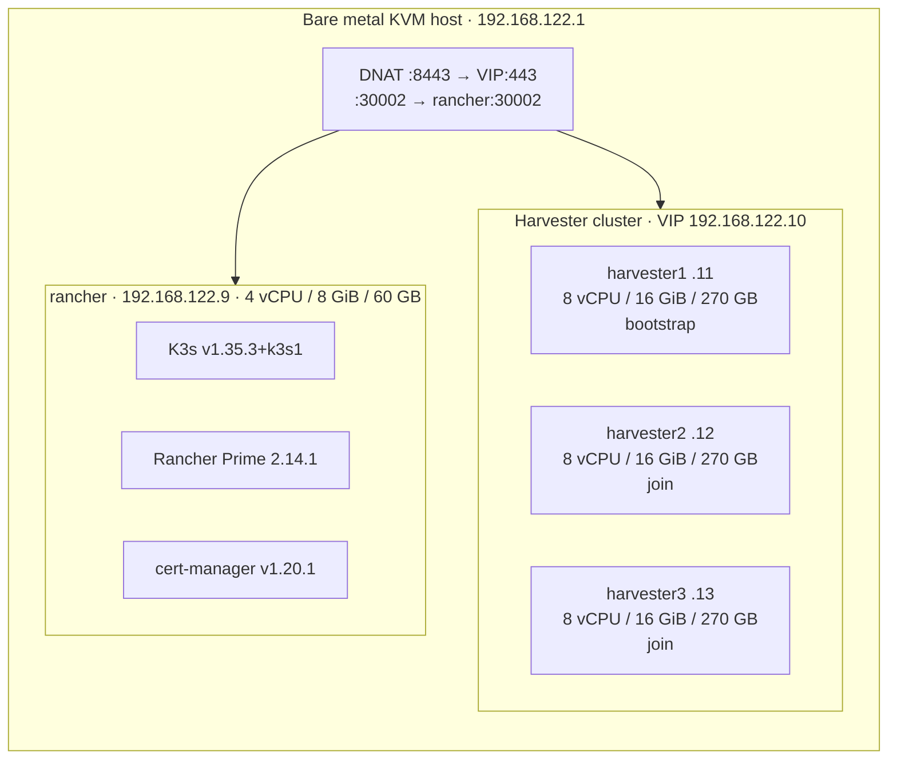
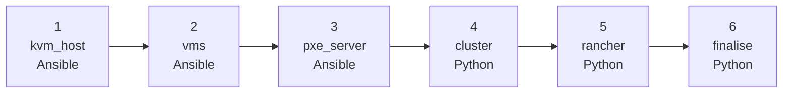

# Lab overview — infrastructure, architecture and deploy pipeline

This page explains the full picture: what infrastructure rodeo-cli builds, what each piece is for, and exactly what happens during `rodeo deploy`. Read it before the exercises to build a mental model, or after if something felt like magic.

---

## Lab topology

The lab runs entirely inside a single bare metal Linux host using nested KVM. All VMs share one NAT network (`virbr0`, `192.168.122.0/24`). The host DNATs ports 8443 and 30002 to the Harvester VIP and the Rancher VM so both UIs are reachable from outside.



---

## Virtual machines

| VM | IP | vCPU | RAM | Disk | Role |
|---|---|---|---|---|---|
| harvester1 | 192.168.122.11 | 8 | 16 GiB | 270 GB | Bootstrap / cluster-init |
| harvester2 | 192.168.122.12 | 8 | 16 GiB | 270 GB | Join node |
| harvester3 | 192.168.122.13 | 8 | 16 GiB | 270 GB | Join node |
| rancher | 192.168.122.9 | 4 | 8 GiB | 60 GB | K3s + Rancher Prime |

**VIP (kube-vip):** `192.168.122.10` — floating, not a node IP.

Harvester installs via **iPXE UEFI network boot**: empty disk → DHCP → `ipxe.efi` (TFTP) → per-node HTTP script → kernel + initrd + squashfs → unattended install from a config YAML. This is the same mechanism SUSE's customer-facing Harvester Rodeo uses — you're running the identical pipeline on your own host.

---

## The deploy pipeline — what rodeo-cli does

`rodeo deploy` runs six phases in order. Each phase is idempotent — an interrupted deploy can resume with `--from <phase>`.



### Phase 1 — kvm_host (Ansible, ~5 min)

Installs KVM packages, enables the modular libvirt daemons (`virtqemud`, `virtnetworkd`, `virtstoraged`), marks `virbr0`/`vnet*` unmanaged in NetworkManager, sets firewalld permanent rules + DNAT (daemon stopped for now), creates the libvirt storage pool, and applies sysctls + SELinux permissive mode.

### Phase 2 — vms (Ansible, ~10 min)

Downloads the Harvester ISO and Rancher base image, defines the NAT network with static DHCP leases per VM, creates disks and OVMF UEFI variable stores, builds the Harvester unattended-install config ISOs and the Rancher cloud-init ISO, and defines all four libvirt domains. Nothing is started yet — disk-first boot order is set so a reboot after install doesn't re-run the installer.

### Phase 3 — pxe_server (Ansible, ~3 min)

Stands up nginx on `virbr0:8080` for HTTP boot artifacts, TFTPs `ipxe.efi`, stages the kernel/initrd/squashfs, and writes per-node iPXE scripts plus their config YAMLs. dnsmasq handles the two-stage UEFI boot (PXE firmware → iPXE → HTTP kernel fetch).

### Phase 4 — cluster (Python, 30-90 min — the long pole)

Starts firewalld, brings `virbr0` up, then boots nodes in sequence: `harvester1` → poll for the VIP to come up (up to 60 min on nested KVM) → `harvester2` → a tuned 90-second etcd join gap → `harvester3` → `rancher`. Once all three nodes are `Ready`, pulls the kubeconfig over SSH.

### Phase 5 — rancher (Python, ~15 min)

Installs K3s, Helm, cert-manager, and Rancher Prime on the rancher VM (NodePort 30002). Sets the admin password via the Rancher API. **This plan sets `harvester_auto_import: false`** — the phase does NOT import Harvester into Rancher automatically. That's Exercise 1. Ejects the Harvester install ISOs so future boots go straight to disk.

### Phase 6 — finalise (Python, ~1 min)

Enables `autostart` on all four VMs and enables `libvirt-guests.service`, so a host reboot brings the whole lab back up on its own. Prints the completion summary with URLs, credentials, and next steps.

---

## What exists when deploy finishes

| Resource | Location | Created by |
|---|---|---|
| libvirt `default` NAT network | virbr0 / 192.168.122.0/24 | vms phase |
| harvester1/2/3 (running, clustered) | .11 / .12 / .13 | vms / pxe_server / cluster phases |
| rancher VM (running) | .9 | vms / cluster phases |
| Kube-vip VIP | .10 | cluster phase (Harvester-internal) |
| K3s + Rancher Prime 2.14.1 | rancher VM | rancher phase |
| cert-manager v1.20.1 | rancher VM | rancher phase |
| DNAT rules (:8443, :30002) | kvm_host phase | kvm_host phase |
| Lab credentials | `~/.rodeo/secrets.yaml` on host | `rodeo init` |

Harvester is **not yet imported into Rancher** and no VM/network/storage/workload objects exist beyond the platform itself — that's the whole point of the exercises.

---

## Lab credentials

All passwords are generated at `rodeo init` time and stored in `~/.rodeo/secrets.yaml` on the host. Nothing is hardcoded anywhere.

```bash
cat ~/.rodeo/secrets.yaml
```

| Key | Used for |
|---|---|
| `harvester_admin_password` | Harvester UI |
| `rancher_admin_password` | Rancher UI and API |

---

## Further reading

- [Host setup](../instructor/host-setup.md) — install and deploy steps for instructors
- [Pre-lab checklist](../instructor/pre-lab-checklist.md) — verify everything before handing to students
- [rodeo-cli source](https://github.com/avaleror/rodeo-cli) — profiles, phases, and Ansible roles
