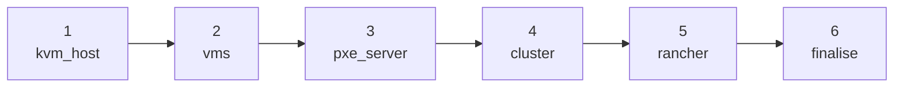

# Lab overview: infrastructure and deploy pipeline

What rodeo-cli builds for this workshop, and what each deploy phase does. Same topology as [suse-virt-rodeo](https://github.com/avaleror/suse-virt-rodeo); here you bring it up yourself with `rodeo up`.

---

## Lab topology

Everything runs on one bare-metal Linux host as nested KVM VMs on the libvirt NAT network `virbr0` (`192.168.122.0/24`). The host DNATs ports **8443** and **30002** so both UIs are reachable from outside.

---

## Virtual machines

| VM | IP | vCPU | RAM | Disk | Role |
|---|---|---|---|---|---|
| harvester1 | 192.168.122.11 | 8 | 16 GiB | 320 GB | Bootstrap / cluster-init |
| harvester2 | 192.168.122.12 | 8 | 16 GiB | 320 GB | Join node |
| harvester3 | 192.168.122.13 | 8 | 16 GiB | 320 GB | Join node |
| rancher | 192.168.122.9 | 4 | 8 GiB | 60 GB | K3s + Rancher Prime |

**VIP (kube-vip):** `192.168.122.10`, floating, not a node IP.

Harvester installs via **iPXE UEFI network boot**: empty disk → DHCP → `ipxe.efi` (TFTP) → per-node HTTP script → kernel + initrd + squashfs → unattended install. This is the same mechanism the customer Rodeo image was built with.

---

## The deploy pipeline

`rodeo up` (or `rodeo deploy`) runs six phases. Each is idempotent; resume with `rodeo deploy --from PHASE`.

### Phase 1: kvm_host (~5 min)

KVM packages, libvirt, firewall + DNAT (`:8443` → VIP, `:30002` → Rancher), storage pool, sysctls.

### Phase 2: vms (~10 min)

Downloads the Harvester ISO and Rancher base image, creates disks and UEFI vars, writes libvirt domain XML. VMs are defined but not started.

### Phase 3: pxe_server (~3 min)

nginx + TFTP + dnsmasq on `virbr0`. Per-node iPXE scripts and Harvester config YAML for unattended install.

### Phase 4: cluster (30-90 min, the long pole)

Starts VMs in order (`harvester1` first, etcd join gap, then the rest). Waits for VIP and all three nodes `Ready`. Nested KVM makes this slow; that is expected.

### Phase 5: rancher (~15 min)

K3s + cert-manager + Rancher Prime on the rancher VM (NodePort 30002). **`harvester_auto_import: false`** - students import in Exercise 1.

### Phase 6: finalise (~1 min)

Enables VM autostart and `libvirt-guests.service`, prints URLs and credentials.

---

## What exists when deploy finishes

| Resource | Created by |
|---|---|
| libvirt NAT `192.168.122.0/24` | vms |
| harvester1/2/3 Ready, VIP up | cluster |
| Rancher Prime on :30002 | rancher |
| DNAT :8443 / :30002 | kvm_host |
| Credentials in `~/.rodeo/secrets.yaml` | `rodeo up` / `init` |
| Harvester **not** listed in Rancher Virtualization Management | by design |

Everything else (namespaces, VM networks, images, SSH keys, guest VMs) is built by students across Exercises 1-8. That differs from the Instruqt Rodeo image, which bakes some of those foundations in; this workshop has you create them so the path is complete on a clean host.

---

## How this maps to suse-virt-rodeo

| Rodeo chapter | This workshop |
|---|---|
| 1 The Arrival | Exercise 1 (+ import, which the image often already has) |
| 2 Subterranean Divide | Exercise 2 (+ create `prod/service`, SSH key, image) |
| 3 Flash Crash | Exercise 3 |
| 4 Rising Tide | Exercise 4 |
| 5 Invisible Intruder | Exercise 5 |
| 6 Unthinkable Error | Exercise 6 |
| 7 Stampede | Exercise 7 |
| 8 Final Showdown | Exercise 8 (ISAware source is simulated on bare metal) |
| 9 New Horizon | Exercise 9 |
