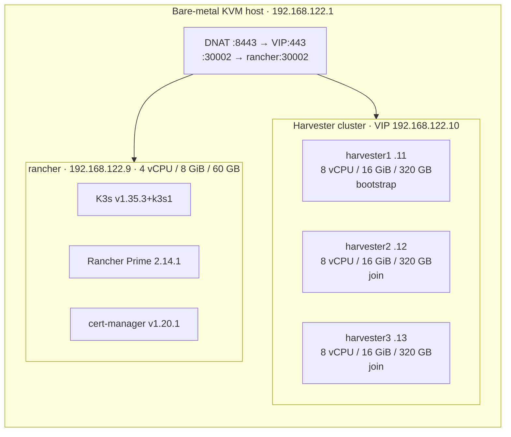
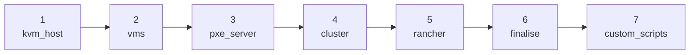

# Lab overview: infrastructure and deploy pipeline

What rodeo-cli builds for this workshop, and what each deploy phase does. Same topology as [suse-virt-rodeo](https://github.com/avaleror/suse-virt-rodeo); here you bring it up yourself with `rodeo up`.

---

## Lab topology

Everything runs on one bare-metal Linux host as nested KVM VMs on the libvirt NAT network `virbr0` (`192.168.122.0/24`). The host DNATs ports **8443** and **30002** so both UIs are reachable from outside.

```mermaid
flowchart TB
    subgraph HOST["  Bare-metal KVM host  ·  192.168.122.1  "]
        direction TB

        subgraph HV["  Harvester cluster  ·  VIP 192.168.122.10  "]
            direction LR
            H1["harvester1  .11\n8 vCPU / 16 GiB / 320 GB\nbootstrap"]
            H2["harvester2  .12\n8 vCPU / 16 GiB / 320 GB\njoin"]
            H3["harvester3  .13\n8 vCPU / 16 GiB / 320 GB\njoin"]
        end

        subgraph RANCHER["  rancher  ·  192.168.122.9  ·  4 vCPU / 8 GiB / 60 GB  "]
            R1["K3s v1.35.3+k3s1"]
            R2["Rancher Prime 2.14.1"]
            R3["cert-manager v1.20.1"]
        end

        DNAT["DNAT  :8443 → VIP:443\n:30002 → rancher:30002"]
    end

    DNAT --> HV
    DNAT --> RANCHER
```

---

## Virtual machines

| VM | IP | vCPU | RAM | Disk | Role |
|---|---|---|---|---|---|
| harvester1 | 192.168.122.11 | 8 | 16 GiB | 320 GB | Bootstrap / cluster-init |
| harvester2 | 192.168.122.12 | 8 | 16 GiB | 320 GB | Join node |
| harvester3 | 192.168.122.13 | 8 | 16 GiB | 320 GB | Join node |
| rancher | 192.168.122.9 | 4 | 8 GiB | 60 GB | K3s + Rancher Prime |

**VIP (kube-vip):** `192.168.122.10`, floating, not a node IP.

Harvester installs via **iPXE UEFI network boot**: empty disk → DHCP → `ipxe.efi` (TFTP) → per-node HTTP script → kernel + initrd + squashfs → unattended install. This is the same mechanism the customer Rodeo image was built with.

---

## The deploy pipeline

`rodeo up` (or `rodeo deploy`) runs seven phases. Each is idempotent; resume with `rodeo deploy --from PHASE`.

```mermaid
flowchart LR
    P1["1\nkvm_host"] --> P2["2\nvms"] --> P3["3\npxe_server"] --> P4["4\ncluster"] --> P5["5\nrancher"] --> P6["6\nfinalise"] --> P7["7\ncustom_scripts"]
```

### Phase 1: kvm_host (~5 min)

KVM packages, libvirt, firewall + DNAT (`:8443` → VIP, `:30002` → Rancher), storage pool, sysctls.

### Phase 2: vms (~10 min)

Downloads the Harvester ISO and Rancher base image, creates disks and UEFI vars, writes libvirt domain XML. VMs are defined but not started.

### Phase 3: pxe_server (~3 min)

nginx + TFTP + dnsmasq on `virbr0`. Per-node iPXE scripts and Harvester config YAML for unattended install.

### Phase 4: cluster (30-90 min, the long pole)

Starts VMs in order (`harvester1` first, etcd join gap, then the rest). Waits for VIP and all three nodes `Ready`. Nested KVM makes this slow; that is expected.

### Phase 5: rancher (~15 min)

K3s + cert-manager + Rancher Prime on the rancher VM (NodePort 30002). **`harvester_auto_import: false`** - students import in Exercise 1.

### Phase 6: finalise (~1 min)

Enables VM autostart and `libvirt-guests.service`, prints URLs and credentials.

### Phase 7: custom_scripts (~10-15 min, mostly the image download) {#custom-scripts}

Runs every executable file in `custom/scripts/` at the repo root, in sorted (numbered) order, with `KUBECONFIG` and a few identifying env vars set. Idempotent and re-run on every `rodeo up`, same as `apply`. This repo ships three:

| Script | What it does |
|---|---|
| `50-image-cache.sh` | Downloads openSUSE Leap 16.0's KVM cloud image (~308 MiB, freely redistributable) and serves it over HTTP on `192.168.122.1:8889` via a systemd unit — feeds the `VirtualMachineImage` the next script needs |
| `60-nfs-backup-target.sh` | Exports `/srv/backups` over NFS to `192.168.122.0/24` — the exact endpoint Exercise 6's backup-target setting expects |
| `70-webserver-prod.sh` | Creates the `prod` namespace, node labels (`stage=prod` on harvester1/2, `stage=dev` on harvester3), the `prod/service` VM network, and both `webserver-prod` and `daily-batch-processor` VMs Exercise 4 needs |

These same scripts (host-agnostic, no baremetal-specific assumptions) power the [`aws/` deploy variant](../../README.md#deploy-on-aws-instead) too, via a symlink (`aws/custom -> ../custom`) — one set of scripts, two deploy targets. They also match [rodeo-cli's bundled `virt-workshop-aws` profile](https://github.com/avaleror/rodeo-cli/tree/main/rodeo/data/examples/virt-workshop-aws), which the AWS variant's remote deploy step actually re-seeds from (see the comment atop `aws/rodeo-plan.yaml` for why) — see that profile's README for the live-verified details (PVC sizing from the image's real virtual size, the hand-derived `prod/service` network shape, the node-pin-then-release sequence for a guaranteed first collision between the two VMs).

---

## What exists when deploy finishes

| Resource | Created by |
|---|---|
| libvirt NAT `192.168.122.0/24` | vms |
| harvester1/2/3 Ready, VIP up | cluster |
| Rancher Prime on :30002 | rancher |
| DNAT :8443 / :30002 | kvm_host |
| Credentials in `~/.rodeo/secrets.yaml` | `rodeo up` / `init` |
| Harvester **not** listed in Rancher Virtualization Management | by design |
| `prod` namespace, node labels, `prod/service` VM network | custom_scripts |
| Cached VM image in `official-images` | custom_scripts |
| NFS export `192.168.122.1:/srv/backups/` | custom_scripts |
| `webserver-prod` and `daily-batch-processor` VMs (`prod`) | custom_scripts |

`custom_scripts` pre-creates the same foundations the Instruqt Rodeo image bakes in for Exercise 4 (webserver-prod/daily-batch-processor) and Exercise 6 (the NFS backup target), so those exercises match the Instruqt track's pre-lab state instead of asking the student to build it by hand. Everything else — the `dev` namespace, the cost-tier StorageClass, your own SSH key, additional VMs and networks — is still built by students across Exercises 2-7, same as before.

---

## How this maps to suse-virt-rodeo

suse-virt-rodeo has exactly 8 chapters — the table below is 1:1, no gaps or renumbering:

| Rodeo chapter | This workshop |
|---|---|
| 1 The Arrival | Exercise 1 (+ import, which the image often already has) |
| 2 Subterranean Divide | Exercise 2 (`prod` namespace and `prod/service` network are now pre-created by `custom_scripts`, same as the Instruqt image — you still create `dev`, the cost-tier StorageClass, and your own SSH key) |
| 3 Flash Crash | Exercise 3 |
| 4 Rising Tide | Exercise 4 (`webserver-prod`/`daily-batch-processor` pre-created by `custom_scripts`, same as the Instruqt image) |
| 5 Invisible Intruder | Exercise 5 |
| 6 Unthinkable Error | Exercise 6 (NFS backup target pre-created by `custom_scripts`, same as the Instruqt image) |
| 7 Stampede | Exercise 7 |
| 8 A New Horizon | Exercise 8 |
| *(no rodeo counterpart)* | [Bonus: The Final Showdown](../exercises/bonus-final-showdown.md) — self-hosted only, explores Harvester's real Migration UI |
